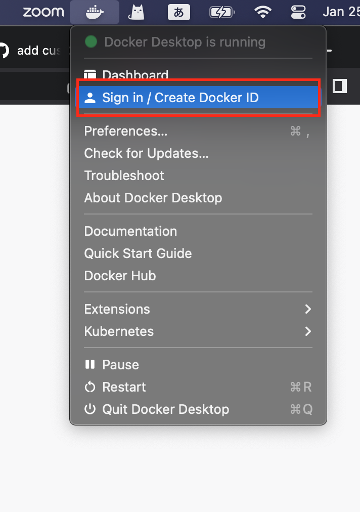

## 目的
CircleCIの実行時間を短縮できるため、CircleCIにcustom imageを使いたいです。

関連issue：https://github.com/CYDASCOM/uranus/issues/32676

関連のslack：[here](https://cydas.slack.com/archives/C01APG65WJ1/p1674645708153389?thread_ts=1674448758.951079&cid=C01APG65WJ1)

## 操作手順

１、`docker desktop`で、`docker hub`のサイダス開発アカウント(`cydascom`)を使って、`sign in`します。



2、ローカル、imageをbuildして、pushします。

```sh
docker build -t cydascom/node-with-python:1.0.0 .
docker push cydascom/node-with-python:1.0.0
```